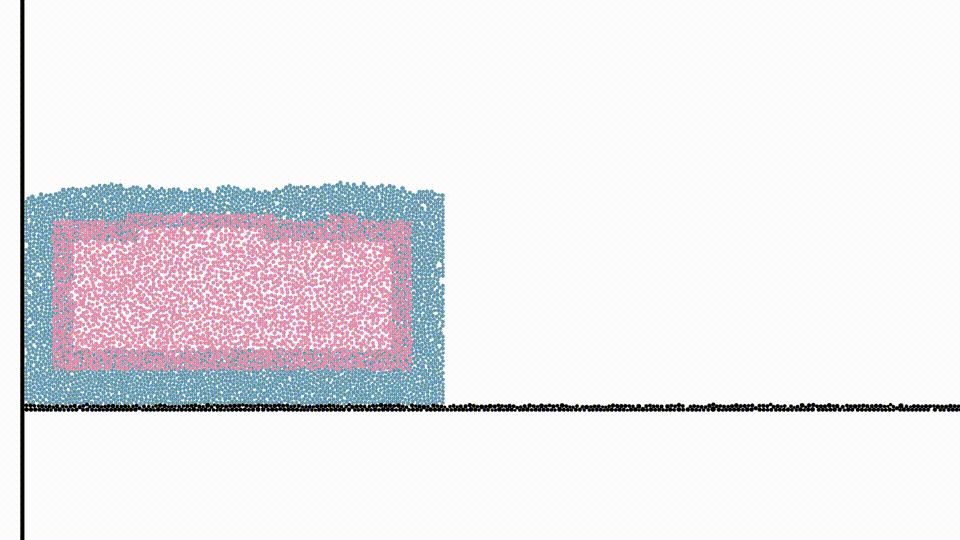

libHybridGrains
=======================================
<p float="left">

</p>

libHybridGrains is an open source project for efficient simulations of granular media. In particular, it is the 2D implementation of the hybrid grains project, Hybrid Grains: Adaptive Coupling of Discrete and Continuum Simulations of Granular Media (see our project page for more details: http://www.cs.columbia.edu/~smith/hybrid_grains ).

The source code contains three parts:
 - A discute simulator based on the Discrete Element Method (DEM)
 - A continuum simulator based on the Material Point Method (MPM)
 - A framework that adaptively couples the discrete simulation and the continuum simulations

We currently do not have a time table for releasing the 3D source code. Please contact us if you are interested.

Dependencies
---------------------

libHybridGrains requires two dependencies for a minimal build:

* [RapidXML](http://rapidxml.sourceforge.net/): An XML parser to read simulation descriptions.

* [Eigen](http://eigen.tuxfamily.org/): A linear algebra library used internally.

We provide a 'get_dependencies.sh' script to automatically download, verify, and extract the supported versions of these libraries.

We recommend a few dependencies for full featured builds:

* [Qt4](http://qt.digia.com/): A user interface library to provide graphical front ends. Available through most standard package managers.

* [HDF5](https://www.hdfgroup.org/HDF5/): A binary file format for data output. Available through most standard package managers.

Quickstart Guide
----------------

To obtain a minimal demo build that simulates granular column collapse:

1. Install Qt4 and CMake. These packages are available from most standard package managers.

2. Clone this repository and change into the project root:

        git clone https://github.com/peterchencyc/libHybridGrains.git
        cd libHybridGrains

3. From the project root, run the script get_dependencies.sh to download, extract, and verify the required dependencies. Note that this script requires the md5sum utility:

        ./get_dependencies.sh

4. Create a build directory under the project root and change into this directory:

        mkdir build
        cd build

5. Run CMake to create the build system with Qt4 enabled:

        cmake -DUSE_QT4=ON ..

6. Build libHybridGrains:

        make -j

7. Load the example simulation:

        cd hybridgrains2dnewqt4
        ./hybridgrains2dnew_qt4 assets/column-collapse/hybrid.xml

8. Click "Simulate" to run the simulation!

Output and Render Data
----------------
To output simulation data to the hard drive, enable HDF5 support and use the cli interface. Inside the build directory, run:

        cmake -DUSE_HDF5=ON ..
        make -j
        cd hybridgrains2dnewcli
        ./hybridgrains2dnew_cli assets/column-collapse/hybrid.xml -f <frame_rate> -o <output_dir>

To render the simulation data, inside the project root, run:

        python scripts_analysis/render_2D_hybrid_configs.py -i <sim_data> -o <output_dir>

Stand-alone Discrete and Continuum Simulations
----------------
We also provide stand-alone qt4 and cli interfaces for running purely discrete simulations and purely continuum simulations. For example, you can run a purely discrete column collapse by runing the following command in the build directory:

        cd rigidbody2dcli
        ./rigidbody2d_cli ../../assets/hybridgrains2dnew/column-collapse/dem.xml -f <frame_rate> -o <output_dir>

and a purely continuum column collpase via:

        cd mpmgrains2d_cli
        ./mpmgrains2d_cli ../../assets/hybridgrains2dnew/column-collapse/mpm.xml -f <frame_rate> -o <output_dir>

scripts_analysis/render_2D_discrete_configs.py and scripts_analysis/render_2D_continuum_configs.py are also provided for rendering the purely discrete and contiuum data.

Citation
---------------
```
@inproceedings{yue2018hybrid,
  title={Hybrid grains: Adaptive coupling of discrete and continuum simulations of granular media},
  author={Yue, Yonghao and Smith, Breannan and Chen, Peter Yichen and Chantharayukhonthorn, Maytee and Kamrin, Ken and Grinspun, Eitan},
  booktitle={SIGGRAPH Asia 2018 Technical Papers},
  pages={283},
  year={2018},
  organization={ACM}
}
```
